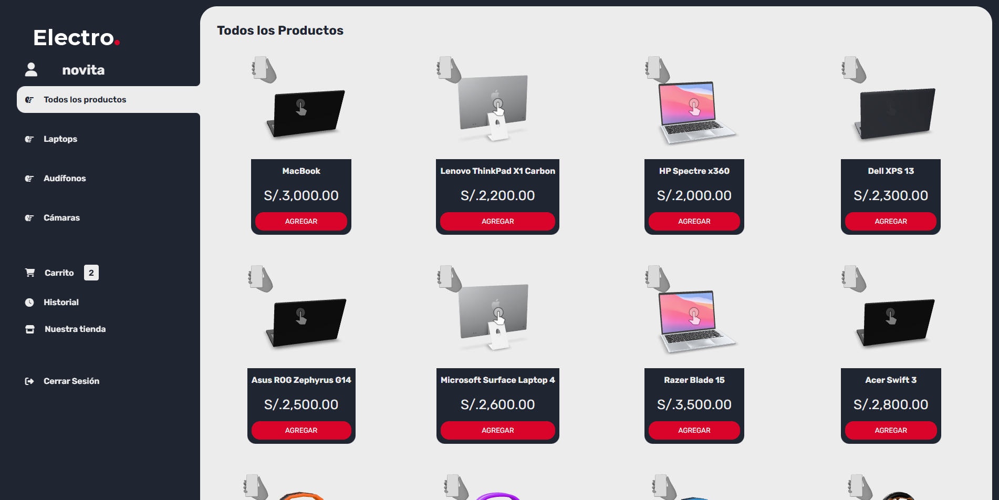
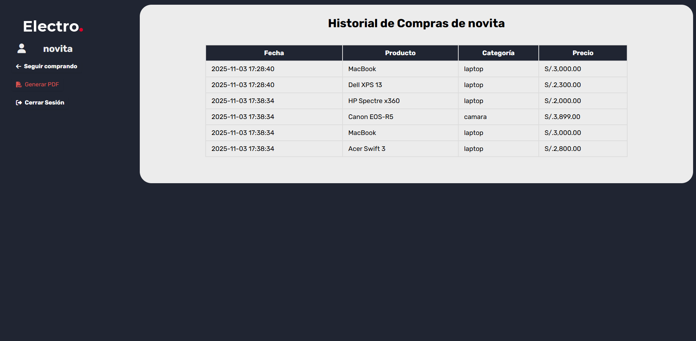

# Electro Store – Tienda Online

Electro Store es una aplicación web desarrollada como proyecto académico para simular una tienda online enfocada en la venta de productos tecnológicos como laptops, cámaras y audífonos.  
Incluye funcionalidades de registro de usuarios, carrito de compras, historial de pedidos y generación de comprobantes PDF.

## Tecnologías Utilizadas

| Tecnología | Descripción |
|-----------|-------------|
| **PHP** | Lógica del sistema y procesamiento del carrito/usuarios |
| **MySQL** | Base de datos para usuarios, productos y compras |
| **HTML / CSS / JS** | Interfaz de usuario y diseño responsivo |
| **Bootstrap** | Estilos y estructura visual |

## Características Principales

- Sistema de autenticación (Login / Registro)
- Listado de productos por categorías
- Agregar productos al carrito
- Eliminar o vaciar carrito
- Cálculo de totales
- Finalizar compra
- Historial de compras por usuario
- Generación de PDF de comprobante de compra

## Capturas del Proyecto

